# Mi Connector
Connector for Xiaomi devices with [SmartThings](https://www.smartthings.com/getting-started)

Simplifies the setup of Xiaomi devices with SmartThings.<br/>
If Mi Connector is installed, virtual devices are registered automatically by the Mi Connector SmartApp.<br/>
You don't have to do anything to add Xiaomi devices in SmartThings IDE.

Please see the [prerequisites](#prerequisites) needed for this connector to work properly.

> Hubitat? Use the following branch: https://github.com/fison67/mi_connector/tree/hubitat

> No more used a arm image.<br/>
Just use a fison67/mi-connector image.

### Example Video<br/>
[](https://www.youtube.com/watch?v=CtPce-KBVcY)

## Donation
If this project helps you, you can give me a cup of coffee<br/>
[](https://paypal.me/fison67)
<br/><br/>

# Table of contents

<!-- TOC depthFrom:1 depthTo:6 withLinks:1 updateOnSave:0 orderedList:0 -->

- [Release Notes](#release-notes)
- [Documentation](#documentation)
	- [Management Web Desktop Version](#management-web-desktop-version)
	- [Management Web Mobile Version](#management-web-mobile-version)
	- [DTH Example](#dth-example)
	- [Supported devices](#supported-devices)
- [Installation](#installation)
	- [Prerequisites](#prerequisites)
	- [Docker Versions](#docker-versions)
		- [Stable Versions](#stable-versions)
		- [Beta Versios](#beta-versions)
	- [Install Mi Connector API Server](#install-mi-connector-api-server)
		- [Raspberry Pi](#raspberry-pi)
		- [Synology NAS](#synology-nas)
		- [Linux x86 x64](#linux-x86-x64)
	- [Install MySQL database](#install-mysql-database)
		- [Raspberry Pi](#raspberry-pi)
		- [Synology NAS](#synology-nas)
		- [Linux x86 x64](#linux-x86-x64)
	- [Mi Connector configuration](#mi-connector-configuration)
	- [Install Device Type Handler (DTH)](#install-device-type-handler-dth)
		- [Manual install](#manual-install)
		- [Install DTH with GitHub Repo integration](#install-dth-with-github-repo-integration)
	- [Install SmartApp](#install-smartapp)
		- [Install SmartApp with GitHub Repo integration](#install-smartapp-with-github-repo-integration)
	- [Install Bluetooth Bridge](#install-bluetooth-bridge)
- [Troubleshooting](#troubleshooting)
- [Library](#library)
- [License](#license)
- [Thanks](#thanks)

<!-- /TOC -->

# Release Notes

### Version: 0.0.6
```
Added support devices.
```

### Version: 0.0.5
```
Added support devices.
```

### Version: 0.0.4
```
Added a function to add a device by db file.
Added support devices.
```

### Version: 0.0.3
```
Added a graph in DTH & Web. [ Important!!! You must install a DB. ]
Added support devices.
Added function [find childs] in a gateway DTH.
Fixed bug when Zigbee device count is over 25, network error occurred
```


More screenshots: https://github.com/fison67/mi_connector/blob/master/imgs/v.0.0.3/README.md

### Version: 0.0.2
```
Added Log page. You can check for an invalid token or see if Mi Connector cannot get a token.
Fixed bugs.
Added refresh feature.
Added support devices.
```

# Documentation

## Management Web Desktop Version
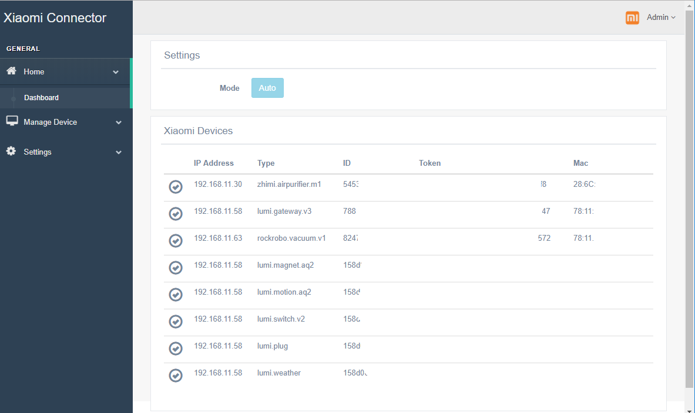

## Management Web Mobile Version
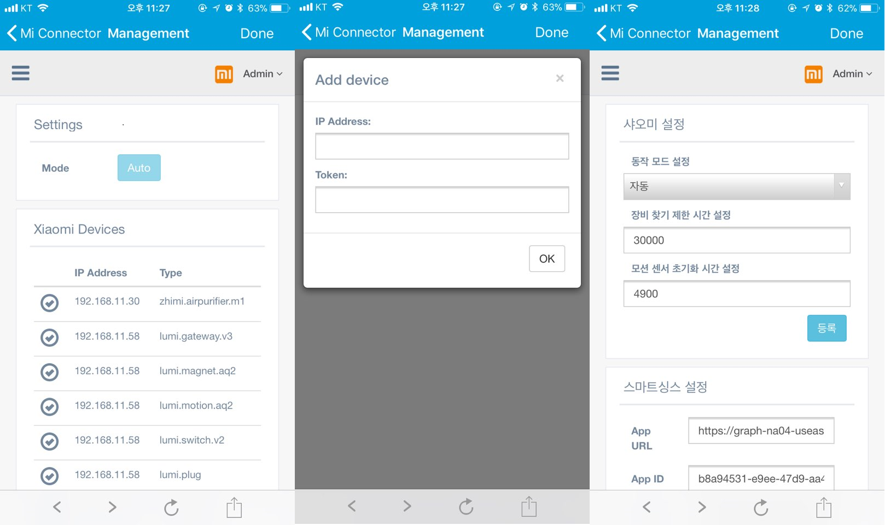

## DTH Example
<a href="./imgs/dth/README.md">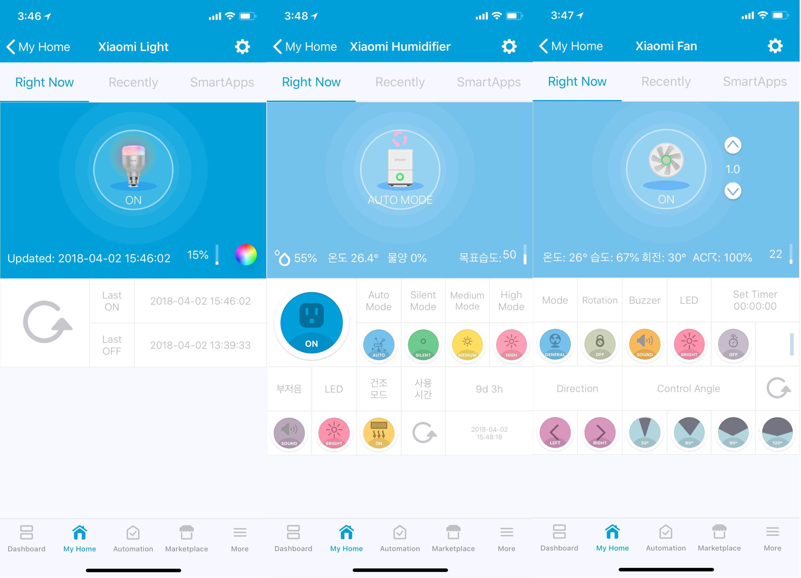

## Supported Devices
### Wi-Fi Devices
| Type  | Model | Tested | Beta |
| ------------- | ------------- | ------------- | ------------- |
| Xiaomi Air Purifier  | zhimi.airpurifier.m1  |   O |    |
|   | zhimi.airpurifier.m2  |   X |    |
|   | zhimi.airpurifier.v1  |   X |    |
|   | zhimi.airpurifier.v2  |   X |    |
|   | zhimi.airpurifier.v3  |   X |    |
|   | zhimi.airpurifier.v6  |   X |    |
|   | zhimi.airpurifier.v7  |   X |    |
|   | zhimi.airpurifier.mc1  |   X |    |
|   | zhimi.airpurifier.ma2  |   X |    |
|   | zhimi.airpurifier.ma4  |   O |    |
|   | zhimi.airpurifier.sa2  |   △ |    |
|   | zhimi.airpurifier.mb3  |   △ |    |
| Xiaomi Air Fresh  | zhimi.airfresh.va2  |   X |   |
| Xiaomi Humidifier  | zhimi.humidifier.v1  |   X |    |
|   | zhimi.humidifier.ca1  |   O |    |
|   | zhimi.humidifier.ca4  |   X |    |
|   | zhimi.humidifier.cb1  |   X |    |
|   | zhimi.humidifier.cb2  |   X |    |
|   | shuii.humidifier.jsq001  |   O |    |
|   | deerma.humidifier.mjjsq  |   O |    |
|   | deerma.humidifier.jsq  |   X |    |
|   | deerma.humidifier.jsq1  |   X |    |
| Xiaomi Dehumidifier  | nwt.derh.wdh318efw1  |   X |    |
| Xiaomi Vacuum  | rockrobo.vacuum.v1  |   O |    |
|   | roborock.vacuum.c1  |   X |    |
|   | roborock.vacuum.s5  |   X |    |
|   | roborock.vacuum.s6  |   X |    |
|   | roborock.vacuum.s5e  |   X |    |
|   | roborock.vacuum.m1s  |   X |    |
|   | roborock.vacuum.e2  |   X |    |
|   | roborock.vacuum.a10  |   X |    |
|   | viomi.vacuum.v6  |   X |    |
|   | viomi.vacuum.v7  |   X |    |
|   | kxf321.mop.mo001  |   X |    |
| Xiaomi Power Socket  | chuangmi.plug.v1  |   X |    |
|   | chuangmi.plug.v2  |   X |    |
|   | chuangmi.plug.v3  |   O |  O  |
|   | chuangmi.plug.m1  |   O |    |
| Xiaomi Power Strip  | qmi.powerstrip.v1  |   X |    |
|   | zimi.powerstrip.v2  |   O |    |
| Xiaomi Air Monitor  | zhimi.airmonitor.v1  |   O |    |
|   | cgllc.airmonitor.b1  |   O |  O |
|   | cgllc.airmonitor.s1  |   O |  O |
| Xiaomi Gateway  | lumi.gateway.v2  |   X |    |
|   | lumi.gateway.v3  |   O |    |
| Xiaomi AC Partner  | lumi.acpartner.v3  |   X |    |
| Xiaomi Fan  | zhimi.fan.v2  |   O |    |
|   | zhimi.fan.v2  |   X |    |
|   | zhimi.fan.v3  |   O |    |
|   | zhimi.fan.sa1  |   X |   |
|   | zhimi.fan.za1  |   O |   |
|   | zhimi.fan.za3  |   X |   |
|   | zhimi.fan.za4  |   X |   |
|   | zhimi.fan.za5  |   X |   |
|   | air.fan.ca23ad9  |   O |   |
|   | dmaker.fan.p5  |   X |   |
|   | dmaker.fan.p8  |   X |   |
|   | dmaker.fan.p9  |   X |   |
|   | dmaker.fan.p10  |   X |   |
|   | dmaker.fan.p11  |   X |   |
| Yeelight Mono  | yeelink.light.lamp1  |   X |    |
|   | yeelink.light.lamp2  |   O |    |
|   | yeelink.light.lamp3  |   O |    |
|   | yeelink.light.mono1  |   O |    |
|   | yeelink.light.ct2  |   O |    |
| Yeelight Color  | yeelink.light.color1  |   O |    |
|   | yeelink.light.color2  |   O |    |
|   | yeelink.light.color3  |   O |    |
|   | yeelink.light.color4  |   O |    |
|   | yeelink.light.color5  |   O |    |
|   | yeelink.light.strip1  |   O |    |
|   | yeelink.light.strip2  |   O |    |
|   | yeelink.light.strip3  |   O |    |
|   | yeelink.light.strip4  |   O |    |
|   | yeelink.light.strip5  |   O |    |
|   | yeelink.light.strip6  |   O |    |
| Bedside Lamp  | yeelink.light.bslamp1  |   O |    |
|   | yeelink.light.bslamp2  |   X |   O |
|  Yeelight Ceiling | yeelink.light.ceiling1  |   O |    |
|   | yeelink.light.ceiling2  |   O |    |
|   | yeelink.light.ceiling3  |   O |    |
|   | yeelink.light.ceiling4  |   O |    |
|   | yeelink.light.ceiling5  |   O |    |
|   | yeelink.light.ceiling6  |   O |    |
|   | yeelink.light.ceiling7  |   △ |    |
|   | yeelink.light.ceiling8  |   △ |    |
|   | yeelink.light.ceiling9  |   △ |    |
|   | yeelink.light.ceiling13  |   △ |    |
|   | yeelink.light.ceiling14  |   △ |    |
|   | yeelink.light.ceiling15  |   △ |    |
|   | yeelink.light.ceiling16  |   △ |    |
|   | yeelink.light.ceiling17  |   △ |    |
|   | yeelink.light.ceiling18  |   △ |    |
|   | yeelink.light.ceiling19  |   △ |    |
|   | yeelink.light.ceiling20  |   △ |    |
|   | yeelink.light.ceil26  |   △ |    |
|  Philips Ceiling | philips.light.ceiling  |   O |    |
|   | philips.light.zyceiling  |   O |    |
| Philips Downlight  | philips.light.downlight  |   O |    |
| Philips Bedside Lamp  | philips.light.moonlight  |   O |    |
| Philips Light  | philips.light.sread1  |   △ |    |
|   | philips.light.bulb  |   △ |    |
|  Xiaomi IR Remote | chuangmi.ir.v2  |   △ |   |
|   | chuangmi.remote.h102a03  |   △ |  O |
|   | chuangmi.remote.v2  |   △ |  O |
|  Xiaomi Heater | zhimi.heater.za1  |   O |   |
|   | zhimi.heater.za2  |   X |   |
|   | zhimi.heater.mc2  |   X |   |
|   | zhimi.elecheater.ma1  |   X |   |

### Zigbee Devices
| Type  | Model | Tested | Beta |
| ------------- | ------------- | ------------- | ------------- |
| Xiaomi Motion Sensor | lumi.motion  |  X  |    |
|  | lumi.motion.aq2  |  O  |    |
| Xiaomi Door/Window Sensor | lumi.magnet  |  X  |    |
|  | lumi.magnet.aq2  |  O  |    |
| Xiaomi Weather Sensor | lumi.weather  |  O  |    |
|  | lumi.sensor_ht  |  O  |    |
| Xiaomi Power Socket | lumi.plug  |  O  |    |
| Xiaomi Button | lumi.switch  |  O  |    |
|  | lumi.switch.v2  |  O  |    |
|  | lumi.86sw1  |  O  |    |
|  | lumi.86sw2  |  O  |    |
| Xiaomi Cube | lumi.cube  |  O  |    |
| Xiaomi Wall Switch | lumi.ctrl_neutral1  |  O  |    |
|  | lumi.ctrl_neutral2  |  O  |    |
| Xiaomi Relay | lumi.relay  |  O  |    |
| Xiaomi Smoke Sensor | lumi.smoke  |  O  |    |
| Xiaomi Gas Sensor | lumi.gas  |  O  |    |
| Xiaomi Water Sensor | lumi.water  |  O  |    |
| Xiaomi Curtain Motor | lumi.curtain  |  O  |    |
| Xiaomi Vibration Sensor | lumi.vibration  |  O  |    |

### Bluetooth Devices
| Type  | Model | Tested | Beta |
| ------------- | ------------- | ------------- | ------------- |
| Xiaomi Flora | ble.flora  |  △  |    |
| Xiaomi Flora Pot | ble.floraPot  |  △  |    |
| Xiaomi Temp-Humid Sensor | ble.mitemperature  |  △  |    |
| Xiaomi E-Ink Temp-Humid Sensor | ble.einktemperature  |  △  |    |

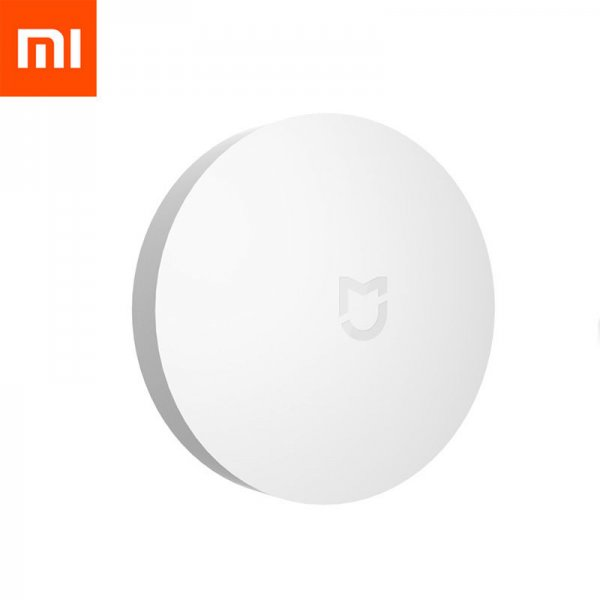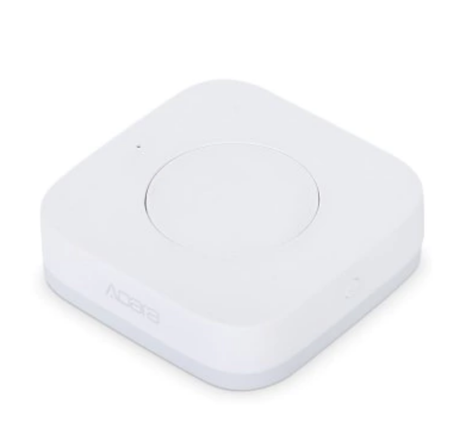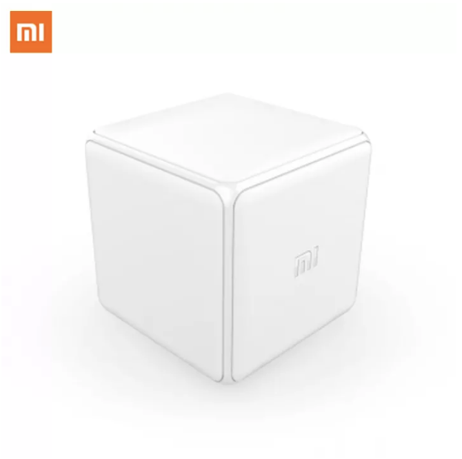
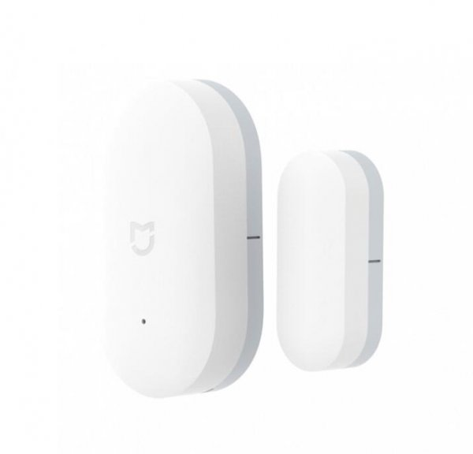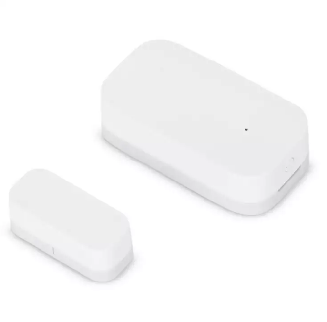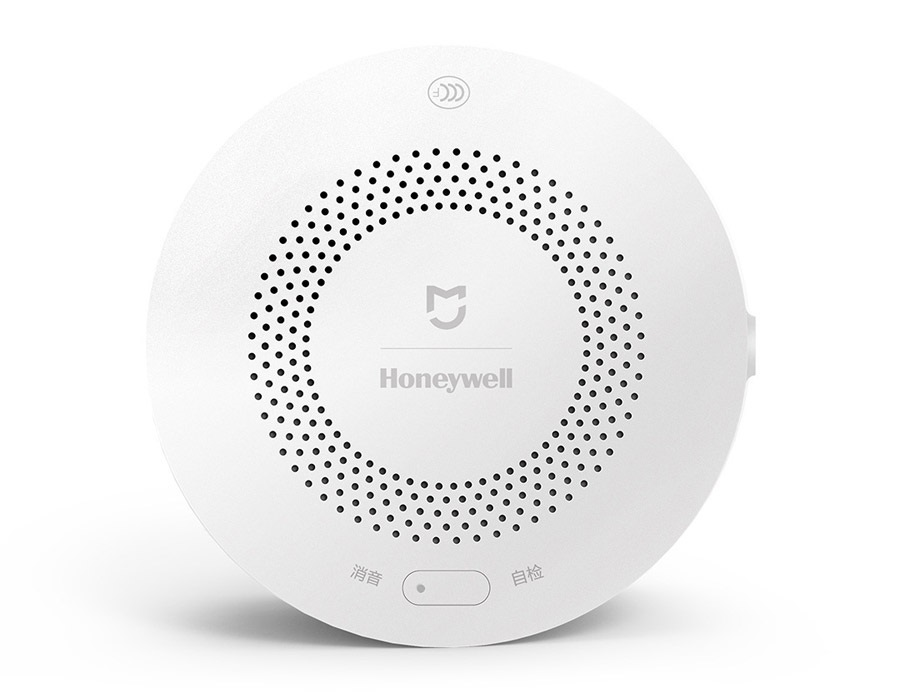
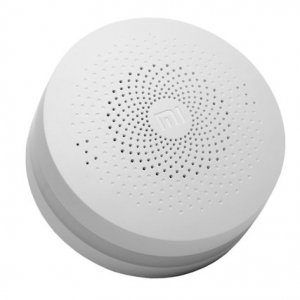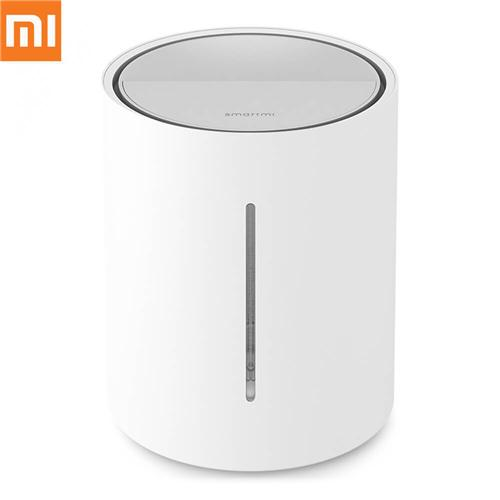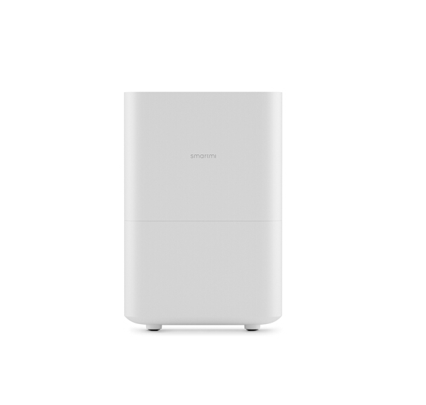
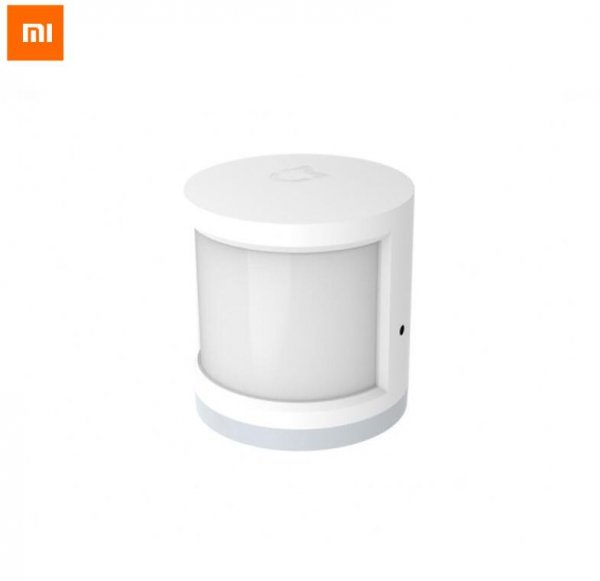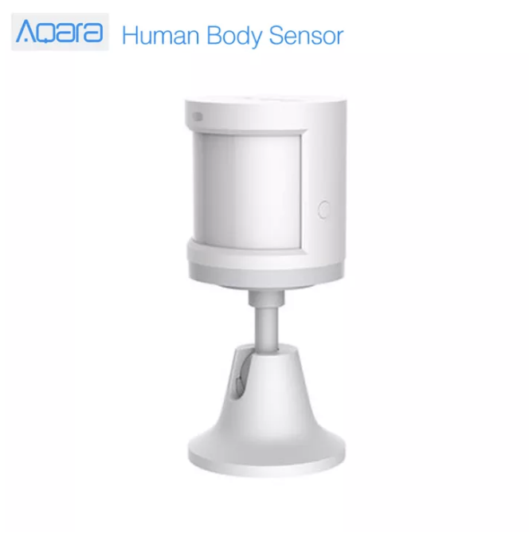
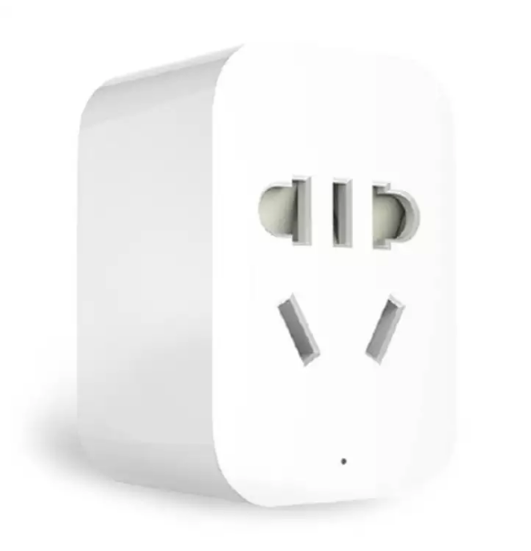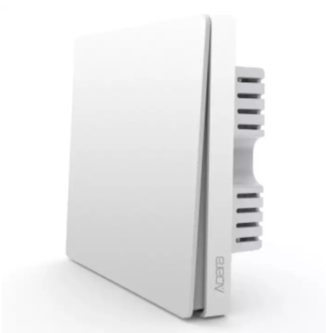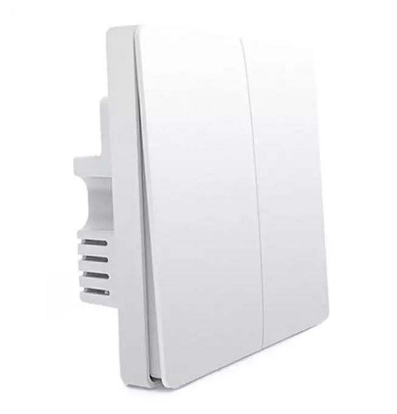
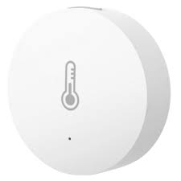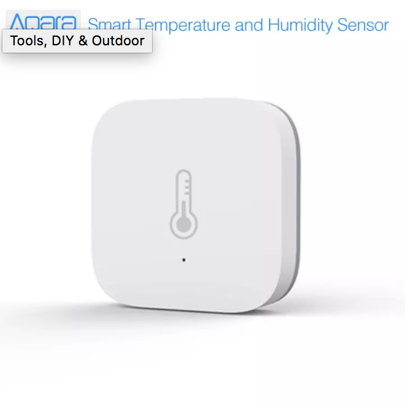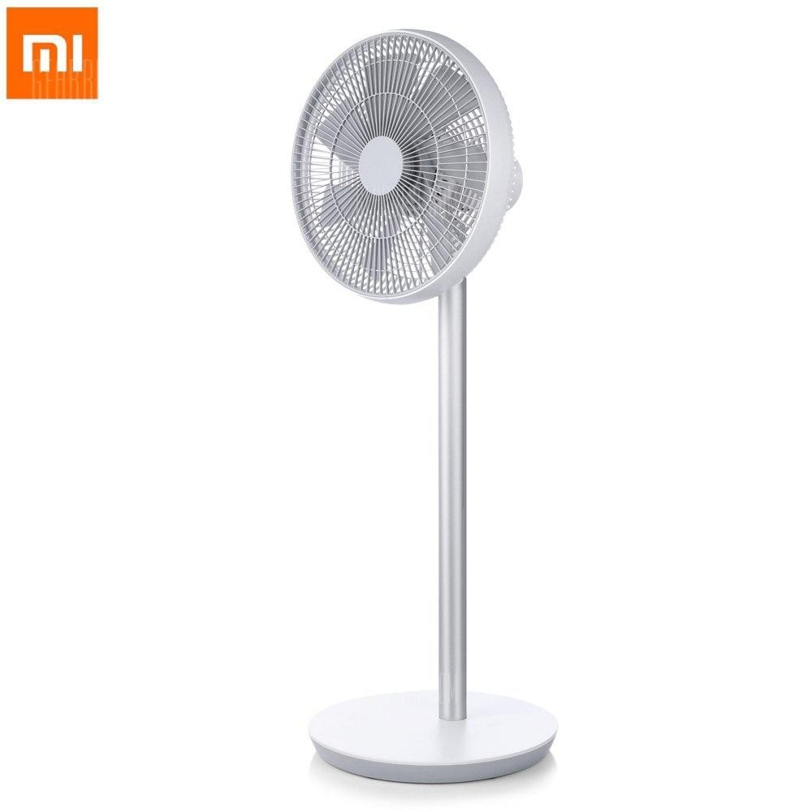
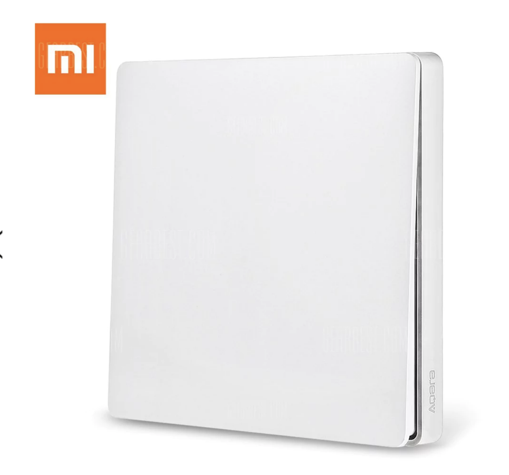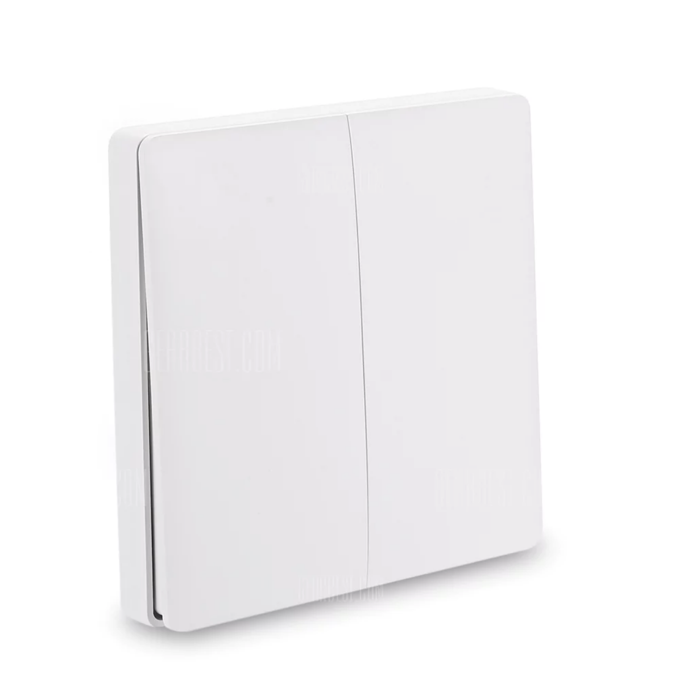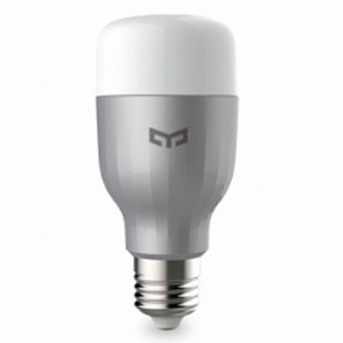
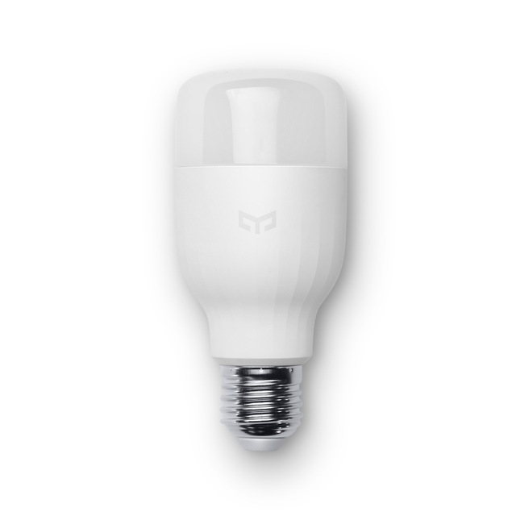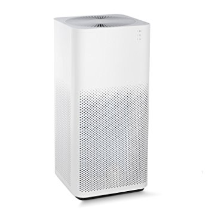


# Installation

## Prerequisites
* SmartThings account
* Local server (Synology NAS, Raspberry Pi, Linux Server) with Docker installed
* Xiaomi Gateway (Only needed for Zigbee devices)
* Built-in bluetooth or dongle available on local server (Only needed for Bluetooth devices)

## Docker Versions

### Stable Versions
| Docker tag |
| ------------- |
|fison67/mi-connector:latest|
|~~fison67/mi-connector-arm:latest~~|


## Install Mi Connector API Server
### Raspberry Pi
> Docker must be installed and running before continuing the installation.

```
sudo mkdir /docker
sudo mkdir /docker/mi-connector
sudo chown -R pi:pi /docker
docker pull fison67/mi-connector:latest
docker run -d --restart=always -v /docker/mi-connector:/config --name=mi-connector --net=host fison67/mi-connector:latest
```

### Synology NAS
> Docker must be installed and running before continuing the installation. <br/>

See the [manual](doc/install/synology/README.md) for details

```
1. Open Docker app in Synology Web GUI
2. Select the Registry tab in the left menu
3. Search for "fison67"
4. Select and download the "fison67/mi-connector" image (choose the "latest" tag for the stable version or see the Docker Versions section above for other versions/tags)
5. Select the Image tab in the left menu and wait for the image to fully download
6. Select the downloaded image and click on the Launch button
7. Give the Container a sensible name (e.g. "mi-connector")
8. Click on Advanced Settings
9. Check the "auto-restart" checkbox in the Advanced Settings tab
10. Click on Add Folder in the Volume tab and create a new folder (e.g. /docker/mi-connector) for the configuration files. Fill in "/config" in the Mount path field.
11.  Check the "Use the same network as Docker Host" checkbox in the Network tab
12. Click on Apply => Next => Apply
```

### Linux x86 x64
> Docker must be installed and running before continuing the installation.

```
sudo mkdir /docker
sudo mkdir /docker/mi-connector
docker pull fison67/mi-connector:latest
docker run -d --restart=always -v /docker/mi-connector:/config --name=mi-connector --net=host fison67/mi-connector:latest
```

## Install MySQL database
### Raspberry Pi
> Docker must be installed and running before continuing the installation.

```
docker pull jsurf/rpi-mariadb
docker run -d --name mariadb -e MYSQL_ROOT_PASSWORD=password1234 -e TZ=Asia/Seoul -p 33006:3306 -d jsurf/rpi-mariadb
```
### Synology NAS
> Docker must be installed and running before continuing the installation.

```
1. Open Docker app in Synology Web GUI
2. Select the Registry tab in the left menu
3. Search for "mariadb"
4. Select and download the "mariadb" image (choose the "latest" tag)
5. Select the Image tab in the left menu and wait for the image to fully download
6. Select the downloaded image and click on the Launch button
7. Give the Container a sensible name (e.g. "mariadb")
8. Click on Advanced Settings
9. Check the "auto-restart" checkbox in the Advanced Settings tab
10. Check the "Use the same network as Docker Host" checkbox in the Network tab
11. Add the following variables in the Environment tab:
    variable: MYSQL_ROOT_PASSWORD, Value: password1234
    variable: TZ, Value: Asia/Seoul
12. Click on Apply => Next => Apply
```
> With the settings above the default DB port is 3306 and must be used during the [Mi Connector configuration](#mi-connector-configuration).

### Linux x86 x64
> Docker must be installed and running before continuing the installation.

```
docker pull mariadb
docker run -d --name mariadb -e MYSQL_ROOT_PASSWORD=password1234 -e TZ=Asia/Seoul -p 33006:3306 -d mariadb
```

## Mi Connector configuration

```
1. Open Mi Connector web settings page (http://X.X.X.X:30000/settings)
2. Fill in the DB settings:
    DB URL (e.g. "localhost")
    DB Port (e.g. "3306", "33006")
    DB Password (e.g. "password1234", "password")
3. Restart Mi Connector Docker container
```

> If you don't add/update the DB values, they must be [ localhost, 33006, password1234 ].

## Install Device Type Handler (DTH)

### Manual install
```
Go to the SmartThings IDE
Click My Device Handlers
Click Create New Device Handlers
Copy content of file in the devicetypes/fison67 folder to the area
Click Create
Loop until all of file is registered
```

### Install DTH using the GitHub Repo integration
> Enable the GitHub integration before continuing the installation. Perform step 1 and 2 in the [SmartThings guide](https://docs.smartthings.com/en/latest/tools-and-ide/github-integration.html#step-1-enable-github-integration) to enable the GitHub integration for your SmartThings account.

```
1. Go to the SmartThings IDE
2. Select the My Device Handlers tab
3. Click on the "Settings" button
4. Click on the "Add new repository" option and fill in the following information:
    Owner: fison67
    Name: mi_connector
    Branch: master
5. Click on the "Save" button
6. Click on the "Update from Repo" button and select the "mi_connector (master)" option
7. Check the checkbox for the device types you need (or all of them) in the "New (only in GitHub)" column
8. Check the "Publish" checkbox and click on the "Execute Update" button
```

## Install SmartApp
See the [Manual](doc/install/smartapp/README.md) file for details
```
Connect to the SmartThings IDE
Click My SmartApps
Click New SmartApp
Click From Code
Copy content of mi_connector.groovy & Paste
Click Create
Click My SmartApps & Edit properties (Mi Connector)
Enable OAuth
Update Click
```

### Install SmartApp using the GitHub Repo integration
> Enable the GitHub integration before continuing the installation. Perform step 1 and 2 in the [SmartThings guide](https://docs.smartthings.com/en/latest/tools-and-ide/github-integration.html#step-1-enable-github-integration) to enable the GitHub integration for your SmartThings account.

```
1. Go to the SmartThings IDE
2. Select the My SmartApps tab
3. Click on the Settings button
4. Click on the "Add new repository" option and fill in the following information:
    Owner: fison67
    Name: mi_connector
    Branch: master
5. Click on the "Save" button
6. Click on the "Update from Repo" button and select the "mi_connector (master)" option
7. Check the checkbox for the device types you need (or all of them) in the "New (only in GitHub)" column
8. Check the "Publish" checkbox and click on the "Execute Update" button
9. Select the My SmartApps tab
10. Click on the "Edit Properties" button for the Mi Connector SmartApp (fison67 : Mi Connector)
11. Click on the "OAuth" option and click on the "Enable OAuth" button
12. Click on the "Update" button
```
Step 3 and 4 are only needed if the repo has not been added earlier (e.g. in the DTH installation).

## Install Bluetooth Bridge
See the [Manual](ble-bridge/README.md) for details
```
Burn a binary to ESP32
```

# Troubleshooting
### Suddenly Mi Connector can't connect to Xiaomi devices
> If IP address and token are correct but not connected, then:
1. Remove the device on MiHome
2. Add the device again on MiHome (Token is regenerated)
3. Add device in Mi Connector again

### Device is not added automatically in auto mode
> If the device is not added automatically by Mi Connector, it must be added manually:
1. Open Mi Connector device list web page (http://X.X.X.X:30000/devices)
2. Click on the "Add" button and fill in the IP address and token
3. Click on the "OK" button

**Known devices:**
>- Yeelight Desk Lamp
- Yeelight Color Bulb
- Yeelight White Bulb
- Yeelight LED Strip
- Mi Robot Vacuum
- Mi Air Quality Monitor (PM2.5)
- Mi Smart Power Strip 1
- Mi Smart Power Strip 2

### How to retrieve device token
> https://www.home-assistant.io/components/vacuum.xiaomi_miio/#retrieving-the-access-token

### When Zigbee devices is not working (No response)
> 1. Open up the MiHome App
2. From the Profile > Settings screen set to the Location field to “Mainland China”
3. Open up the device detail screen for the Gateway device
4. Click the triple dots button in the top-right corner of the screen to open the More screen
5. Open the About screen
6. At the bottom of the screen keep tapping the version number until a notice appears
7. From the same screen open the Local Area Network Communication Protocol screen
8. Slide the toggle element for “Local Area Network Communication Protocol” to enabled<br/>

9. Restart Mi Connector and then register gateway.<br/>
10. If you do step by step, but zigbee device is not working<br/>
install a nmap first.<br/>
sudo nmap -sU gatewayip -p 9898, 4321<br/>
..................................<br/>
PORT     STATE         SERVICE<br/>
4321/udp open|filtered rwhois<br/>
9898/udp open          monkeycom<br/><br/>
..................................<br/>
If Port is closed xiaomi gateway doesn't report zigbee status to mi connector anymore.<br/>
You have to buy new one and enable a lan protocol first, don't firmware update first!!!<br/>
Or have a look this link<br/>
https://community.openhab.org/t/solved-openhab2-xiaomi-mi-gateway-does-not-respond/52963/114<br/>
<br/><br/>

### When you can't control device on ST
> Maybe you put the server address on SmartApp (Mi Connector)<br/>
If it's wrong server address and device is added already, just stop docker and remove all devices which was added by Mi Connector.<br/>
Even if you change the address, the server address of each device is not updated. So you must remove devices.<br/>
And put the right server address.(ex. 192.168.1.22:30000), restart Docker container.<br/>
When you control device on ST, if you can see the following the log it means that communication is working well with ST.<br/>
2018-09-17 03:14:14 [info]: Requested to control by ST >> [zhimi.airpurifier.m1] >> {"id":"54532856","cmd":"power","data":"off"}<br/>
If you can't see anything, it's not working well..

# Library
- https://github.com/aholstenson/miio
- https://github.com/zlargon/google-tts

# License

This project is licensed under the MIT License - see the [LICENSE](LICENSE) file for details

# Thanks
- Many thanks to [ShinJjang](https://github.com/shin4299) for testing and updating DTH.
