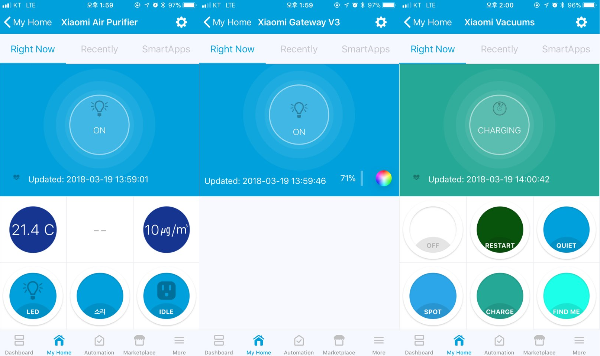

# Mi-Connector
Connector for Xiaomi Devices with ST

This makes you easy to setup xiaomi devices to Smartthings.<br/>
If Mi-Connector is installed, virtual devices is registered automatically by Mi Connector Smartapp.<br/>
You don't have to do something to add xiaomi device in Smartthings IDE.

<br/><br/>
#### Example Video<br/>
[](https://www.youtube.com/watch?v=CtPce-KBVcY)

<br/><br/>


<br/><br/>
## Management Web Desktop Version.<br/>
 


<br/><br/>

## Management Web Mobile Version.<br/>
 


<br/><br/>
## DTH Example<br/>
 


<br/><br/>

# Install
#### Preparing
```
You need a Raspbery pi or Synology Nas to install Mi Connector API Server
```
<br/><br/>

## Install API Server<br/>
#### Raspberry pi<br/>
> You must install docker first.
```
sudo mkdir /docker
sudo mkdir /docker/mi-connector
sudo chown -R pi:pi /docker
docker pull fison67/mi-connector-arm:lastest
docker run -d --restart=always -v /docker/mi-connector:/config --name=mi-connector-arm --net=host fison67/mi-connector-arm:lastest
```

###### Synology nas<br/>
> You must install docker first.<br/>
See the [Manual](doc/install/synology/README.md) file for details<br/>
Current Beta version is 'mi-connector:test'
```
make folder /docker/mi-connector
Run Docker
-> Registery 
-> Search fison67/mi-connector
-> Advanced Settings
-> Volume tab -> folder -> Select mi-connector & Mount path '/config'
-> Network tab -> Check 'use same network as Docker Host'
-> Complete
```
<br/><br/>
 
## Install DTH<br/>
```
Go to the Smartthings IDE
Click My Device Handlers
Click Create New Device Handlers
Copy content of file in the dth folder to the area
Click Create
Loop until all of file is registered
```
<br/><br/>

## Install Smartapps<br/>
See the [Manual](doc/install/smartapp/README.md) file for details
```
Connect to the Smartthings IDE
Click My Smartapps
Click New Smartapp
Click From Code 
Copy content of mi_connector.groovy & Paste
Click Create
Click My Smartapps & Edit properties (Mi-Connector)
Enable OAuth
Update Click
```

<br/><br/>

## Problem solving
#### Some of xiaomi product is not registered
> Some of product is not getting token automatically like Xiaomi Vacuum. You have to get token yourself.<br/>
And go to the 'Manage Device' > 'Device List' >  Click the add button > Fill out the blank. (IP & Token) > Click OK Button
<br/><br/>

## These devices is not working auto mode.
### You must add device manually
#### Management Web -> Manage Device -> Device List -> Fill the address & token -> Add Button
- Yeelight Desk Lamp
- Yeelight Color Bulb
- Yeelight White Bulb
- Yeelight LED Strip
- Mi Robot Vacuum
- Mi Air Quality Monitor (PM2.5)
- Mi Smart Power Strip 1
- Mi Smart Power Strip 2

## Support devices<br/>
#### Wi-Fi Version
| Type  | Model | Tested |
| ------------- | ------------- | ------------- |
| Xiaomi air purifier  | zhimi.airpurifier.m1  |   O |
|   | zhimi.airpurifier.v1  |   X |
|   | zhimi.airpurifier.v2  |   X |
|   | zhimi.airpurifier.v3  |   X |
|   | zhimi.airpurifier.v6  |   X |
|   | zhimi.airpurifier.ma2  |   X |
| Xiaomi humidifier  | zhimi.humidifier.v1  |   X |
| Xiaomi humidifier2 | zhimi.humidifier.ca1  |   O |
| Xiaomi vacuum  | rockrobo.vacuum.v1  |   O |
|   | roborock.vacuum.s5  |   X |
| Xiaomi Power Socket  | chuangmi.plug.v1  |   X |
|   | chuangmi.plug.v2  |   X |
|   | chuangmi.plug.m1  |   X |
| Xiaomi air monitor  | zhimi.airmonitor.v1  |   O |
| Xiaomi gateway  | lumi.gateway.v2  |   X |
|   | lumi.gateway.v3  |   O |
| Xiaomi Fan  | zhimi.fan.v3  |   O |
| Yeelight Mono  | yeelink.light.lamp1  |   X |
|   | yeelink.light.mono1  |   O |
| Yeelight Color  | yeelink.light.color1  |   O |
|   | yeelink.light.strip1  |   O |

#### Zigbee Version
| Type  | Model | Tested |
| ------------- | ------------- | ------------- |
| Xiaomi motion sensor | lumi.motion  |  X  |
|  | lumi.motion.aq2  |  O  |
| Xiaomi door/window sensor | lumi.magnet  |  X  |
|  | lumi.magnet.aq2  |  O  |
| Xiaomi weather sensor | lumi.weather  |  O  |
| Xiaomi weather sensor | lumi.sensor_ht  |  O  |
| Xiaomi power socket | lumi.plug  |  O  |
| Xiaomi Button | lumi.switch  |  O  |
|  | lumi.switch.v2  |  O  |
|  | lumi.86sw1  |  O  |
|  | lumi.86sw2  |  O  |
| Xiaomi Cube | lumi.cube  |  O  |
| Xiaomi Wall Switch | lumi.ctrl_neutral1  |  O  |
| Xiaomi Wall Switch | lumi.ctrl_neutral2  |  O  |
| Xiaomi Smoke Sensor | lumi.smoke  |  O  |


<br/><br/>
## Library
- https://github.com/aholstenson/miio
- https://github.com/zlargon/google-tts

<br/><br/>
## License

This project is licensed under the MIT License - see the [LICENSE](LICENSE) file for details

<br/><br/>
## Donation

[](https://paypal.me/fison67)


