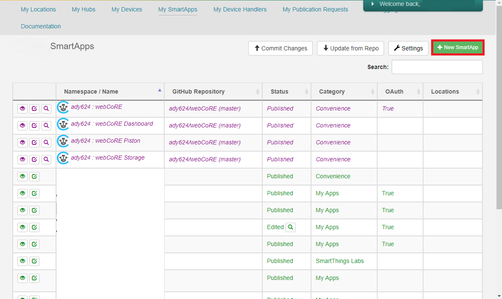
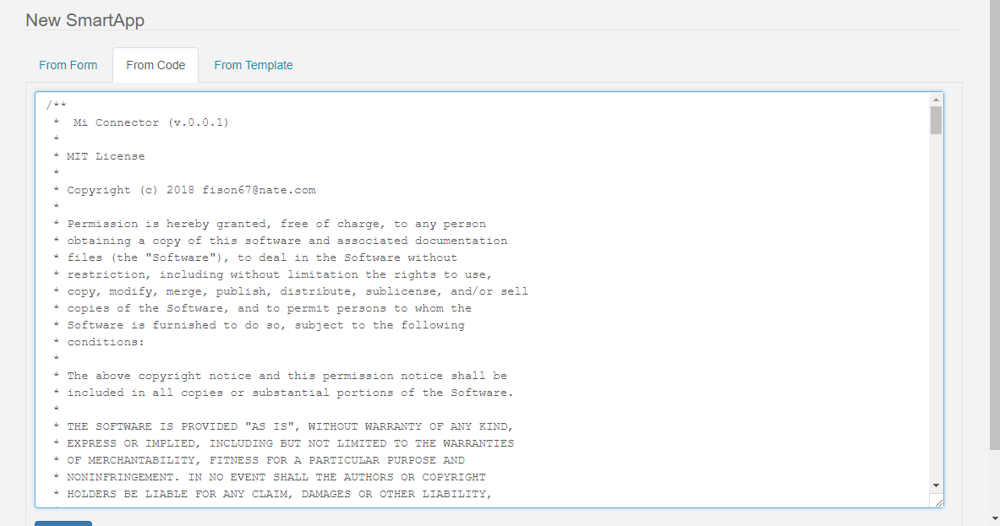
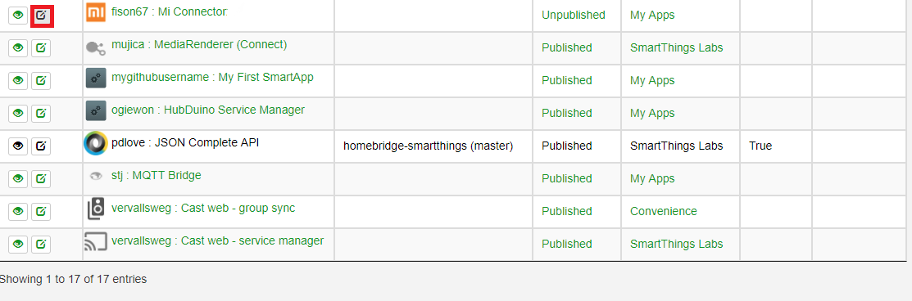
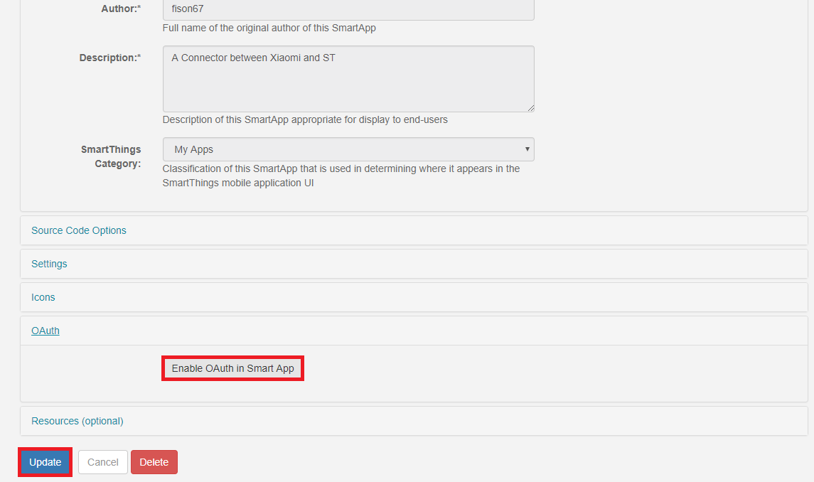
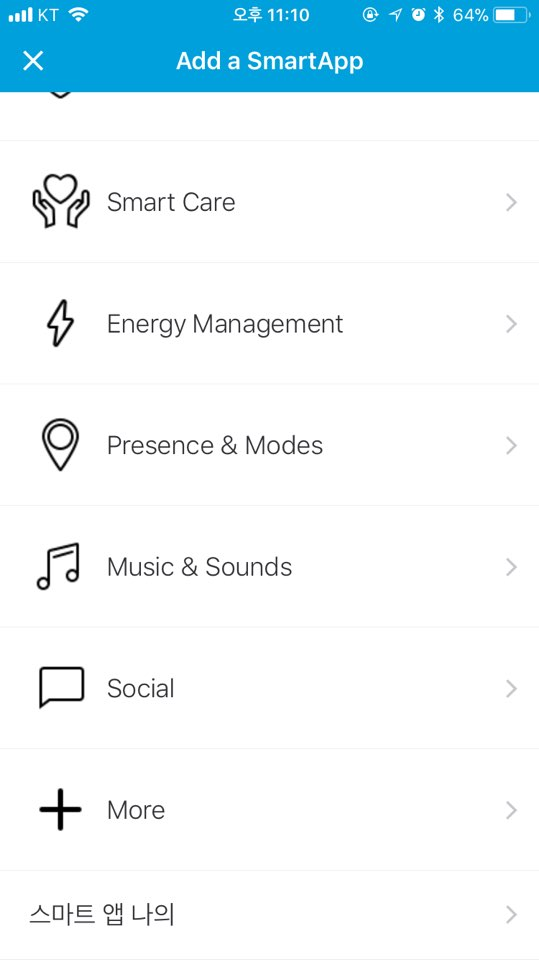
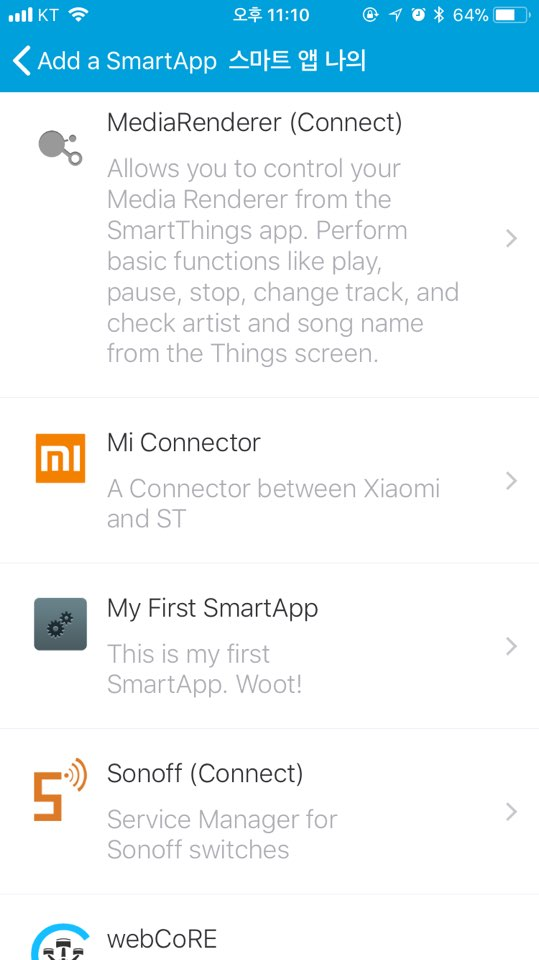
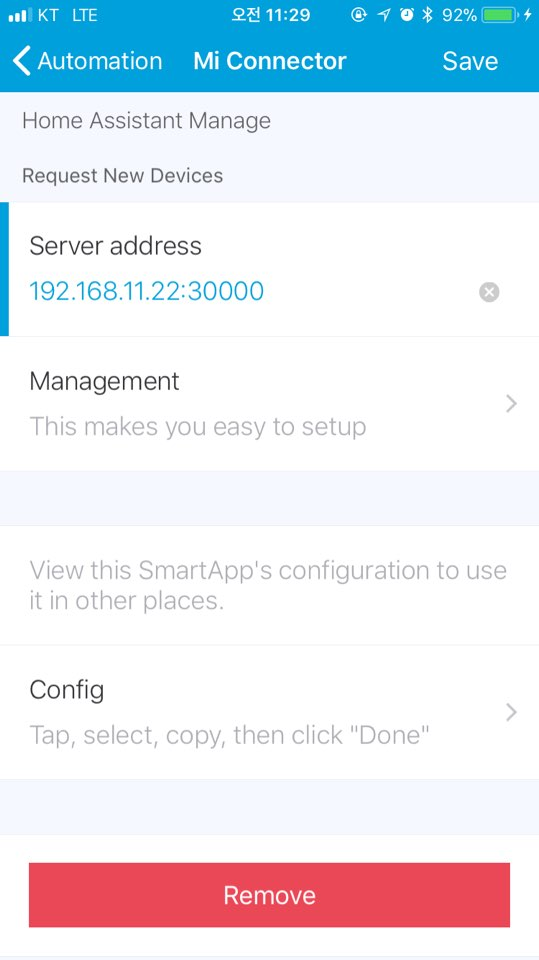

## Open Smartthings IDE. 

#### Click New Smartapp 
 

#### Click From Code tab 
 

#### Paste code 
 

#### Click Edit Properties 
 

#### Click Enable OAuth 
 

  

## Open Smartthings App. 

#### Click Automation Tab and click Add a SmartApp 
 

#### Click My Smartapp 
 

#### Select Mi Connector 
 

#### Fill the blank with local address and Click the save button 
Be careful. The address is not external ip. 
 
