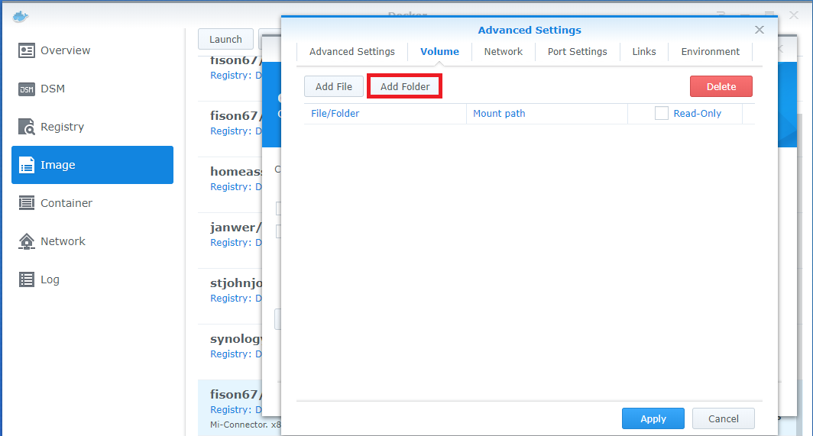
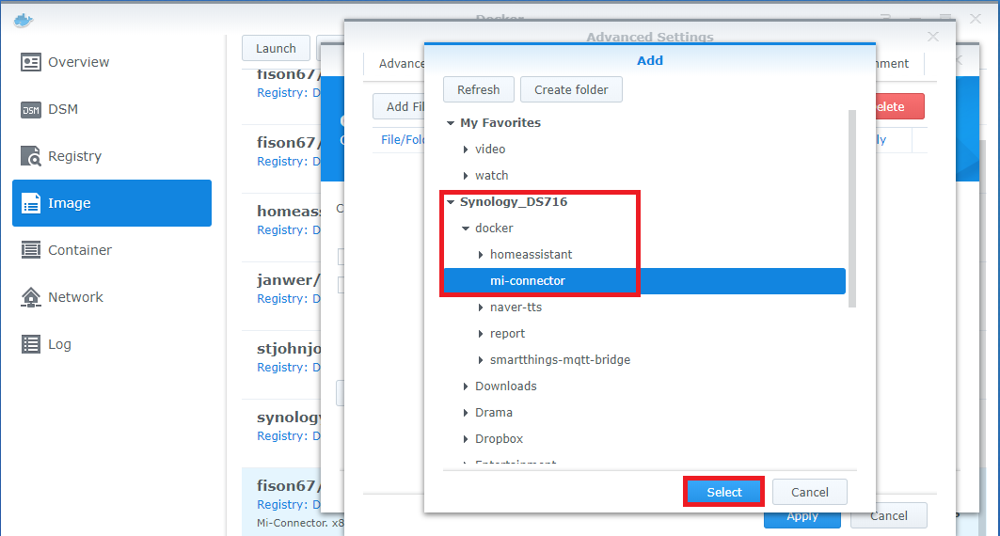
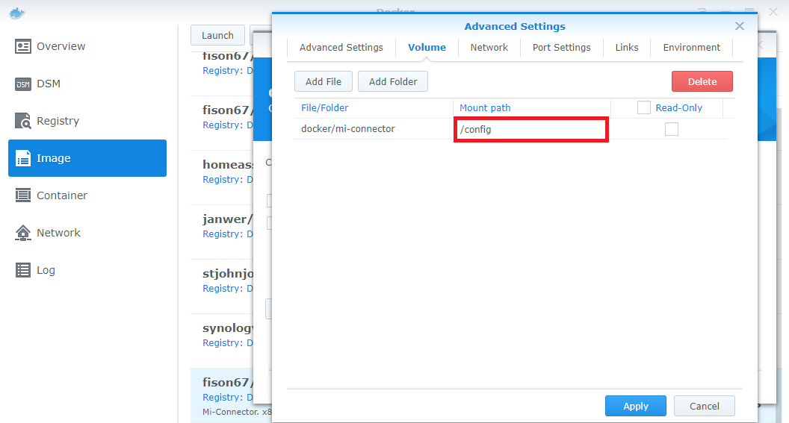
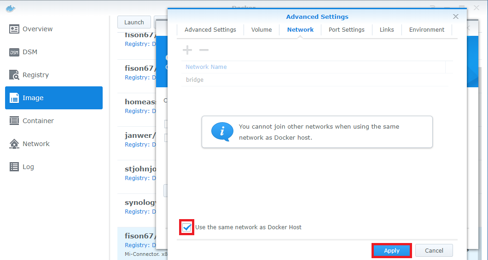
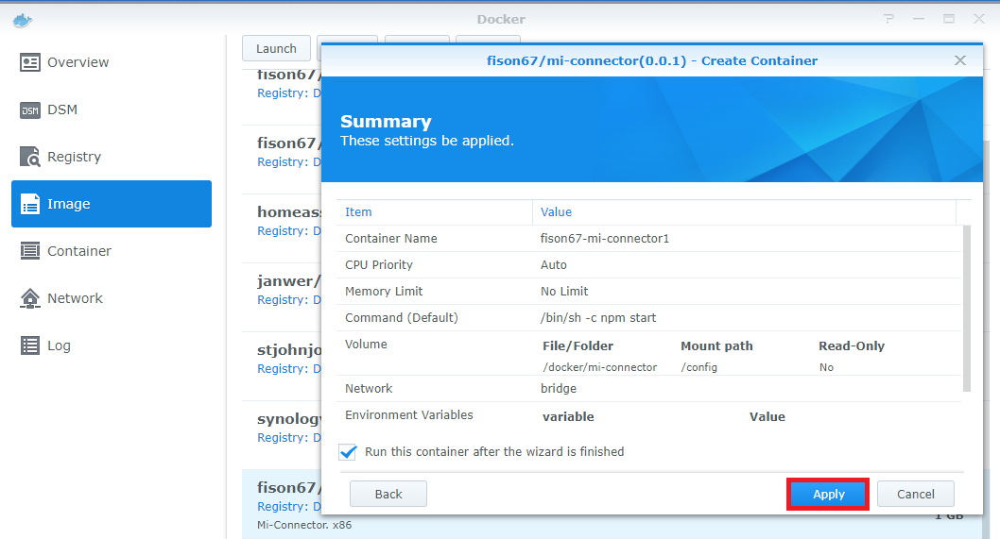

# Install Mi Connector on Synology Nas


#### Preparing
```
You must install docker on your nas
```
<br/><br/>

### Search docker image
 
<br/>

### Download image
 
<br/>

### Launch image
 
<br/>

### Setting volume
 
 
 
<br/>

### Setting network
 
<br/>

### Finish
 
<br/><br/>

### Default URL
http://nas_address:30000/

If other application in nas use 30000, 30001 port, you have to modify ports.
Open /docker/mi-connector/config.json and modify port.

If you can't find config.json
just make it like below
```
{
  "st": {
    "app_url": "",
    "app_id": "",
    "access_token": ""
  },
  "connector": {
    "port": 30000,
    "websocketPort": 30001
  },
  "xiaomi": {
    "find_limit_time": "30000",
    "motion_reset_time": "4900",
    "find_mode": "auto"
  },
  "devices": {
    "list": [
    ]
  }
}

```
